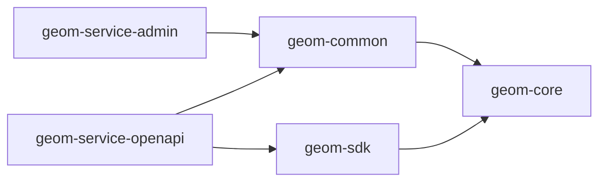

# 写给项目维护者

首先，向所有参与本项目的开发者致谢。

在本文档中，我将向您介绍如何参与 geom 项目后端部分的开发。

## 项目结构

```
geom
├── geom-service  # 服务目录
│   ├── geom-service-admin  # 系统管理服务
│   └── geom-service-openapi  # 开放平台服务
├── geom-common  # 各服务共享的 bean
├── geom-core  # 用于存放一些共享的内容（如全局常量、DTO）
└── geom-sdk  # 提供给系统内其他服务调用 geom 服务的客户端
```

### 模块间依赖关系



### Java package

一个服务可能会提供多种功能，所以我们将会像这样组织项目的包：

```
geom-service-admin
├── src
│   ├── main
│   │   ├── java
│   │   │   └── io/github/xezzon/geom
│   │   │       ├── user  # 用户功能
│   │   │       │   ├── UserService.java  # 该功能的逻辑运转中枢
│   │   │       │   ├── UserController.java  # 提供前端调用的 HTTP 接口
│   │   │       │   ├── UserRpcAdaptor.java  # 提供其他服务调用的 RPC 接口
│   │   │       │   ├── domain  # 模型
│   │   │       │   ├── convert  # MapStruct 接口
│   │   │       │   ├── repository  # DAO 接口
│   │   │       │   ├── service   # 向其他包提供的功能的接口定义
│   │   │       │   └── README.md  # 该功能的细节说明
│   │   │       ├── dict  # 字典功能
│   │   │       └── AdminApplication.java  # 启动类
│   │   └── resources
│   │       └── config
│   └── test  # 单元测试代码
│       ├── java
│       └── resources
└── target
    └── generated-sources  # 由 Maven 插件生成的代码，是成品的一部分，请不要试图改动
```

## 如何运行与测试

`TODO`

## 代码规范

代码规范参考[《阿里巴巴Java开发指南》](https://github.com/alibaba/p3c)和[《Google Java Style Guide》](https://google.github.io/styleguide/javaguide.html)。

### 接口规范

与前端交互的HTTP接口参考[微软API设计规范](https://github.com/microsoft/api-guidelines/blob/vNext/azure/Guidelines.md)。如：

- `GET /dict/id/{id}` 根据ID查询字典
- `GET /dict/page?filter=&pageNum=&pageSize=` 查询字典列表（分页）
- `GET /dict/tag/{tag}/code/{code}` 根据字典目、字典码查询字典
- `GET /dict/tag-code?tag=&code=` 根据字典目、字典目查询字典（风格二）
- `DELETE /dict/id/{id}` 根据ID删除字典
- `POST /dict/add` 新增字典
- `PUT /dict/update` 整体更新字典

注意：路径参数都要放在第奇数位。

如果有（不能简单地表示为增删查改的）复杂指令，非幂等的可以用`POST`方法，幂等的使用`PUT`方法。

更新、删除接口无需返回值（即返回类型为void）。标准新增接口的返回值为：`{"id":""}`，将新增后对象的ID返回，便于进行自动化测试。查询接口的返回值应为对象/对象列表/分页对象。响应码为`200`。

若程序遇到了逻辑错误，应当抛出`io.github.xezzon.tao.exception.BaseException`的子类。若是客户端异常（即需要用户处理的异常）响应码为`400`，服务端异常或第三方服务异常响应码为`500`。响应体结构为`{"code":"","message":"","data":{}}`

---

服务间交互采用[gRPC协议](https://grpc.io/)。

---

与第三方系统交互采用HTTP协议，统一使用`POST`方法，URI与方法同名。如：

- `POST /getDictByTagAndCode` 根据字典目、字典码查询字典

---

在同一个主版本下，接口应该保证兼容性——客户端不改变传参的情况下，服务端应该能够给出正确且相同的反应。

如果同一个接口需要同时支持新、旧不同的方法，则应该通过 HTTP Header 中的 `X-API-VERSION` 参数路由到不同的方法。同时将旧方法注解为`@Deprecated`，并在下一个大版本中考虑将其移除。

## 配置规范

`TODO`

## 工程规范

`TODO`

## 提交规范

`TODO`
