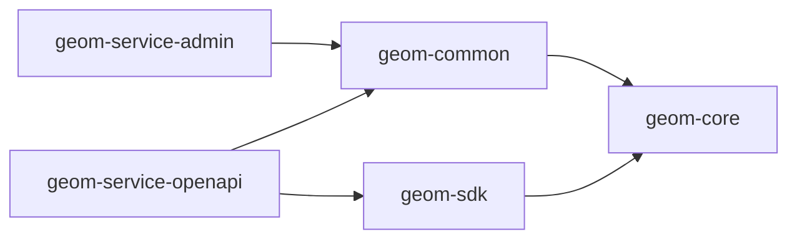

# 写给项目维护者

首先，向所有参与本项目的开发者致谢。

在本文档中，我将向您介绍如何参与 geom 项目后端部分的开发。

## 项目结构

```
geom
├── geom-service  # 服务目录
│   ├── geom-service-admin  # 系统管理服务
│   └── geom-service-openapi  # 开放平台服务
├── geom-common  # 各服务共享的 bean
├── geom-core  # 用于存放一些共享的内容（如全局常量、DTO）
└── geom-sdk  # 提供给系统内其他服务调用 geom 服务的客户端
```

### 模块间依赖关系



### Java package

一个服务可能会提供多种功能，所以我们将会像这样组织项目的包：

```
geom-service-admin
├── src
│   ├── main
│   │   ├── java
│   │   │   └── io/github/xezzon/geom
│   │   │       ├── user  # 用户功能
│   │   │       │   ├── UserService.java  # 该功能的逻辑运转中枢
│   │   │       │   ├── UserController.java  # 提供前端调用的 HTTP 接口
│   │   │       │   ├── UserRpcAdaptor.java  # 提供其他服务调用的 RPC 接口
│   │   │       │   ├── domain  # 模型
│   │   │       │   ├── convert  # MapStruct 接口
│   │   │       │   ├── repository  # DAO 接口
│   │   │       │   ├── service   # 向其他包提供的功能的接口定义
│   │   │       │   └── README.md  # 该功能的细节说明
│   │   │       ├── dict  # 字典功能
│   │   │       └── AdminApplication.java  # 启动类
│   │   └── resources
│   │       └── config
│   └── test  # 单元测试代码
│       ├── java
│       └── resources
└── target
    └── generated-sources  # 由 Maven 插件生成的代码，是成品的一部分，请不要试图改动
```

## 如何运行与测试

`TODO`

## 代码规范

`TODO`

## 配置规范

`TODO`

## 工程规范

`TODO`

## 提交规范

`TODO`
