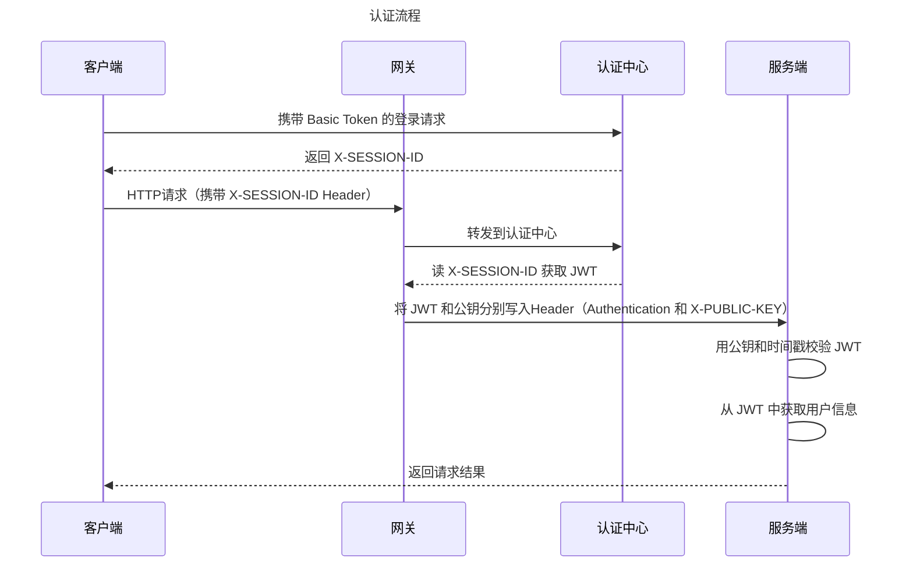
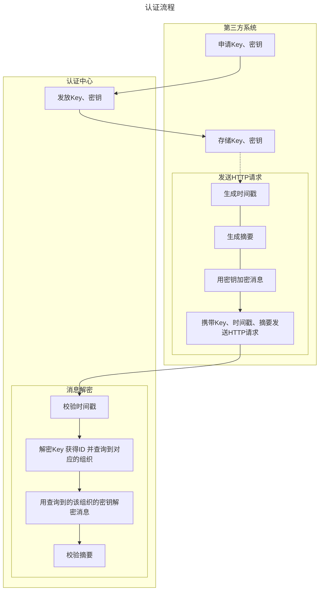

# 认证

## 用户认证（前端）

```mermaid
---
title: 认证流程
---
sequenceDiagram
    participant client AS 客户端
    participant gateway AS 网关
    participant auth AS 认证中心
    participant service AS 服务端
    
    client ->> auth: 携带 Basic Token 的登录请求
    auth -->> client: 返回 X-SESSION-ID
    
    client->> gateway: HTTP请求（携带 X-SESSION-ID Header）
    gateway ->> auth: 转发到认证中心
    auth -->> gateway: 读 X-SESSION-ID 获取 JWT
    gateway ->> service: 将 JWT 和公钥分别写入Header（Authentication 和 X-PUBLIC-KEY）
    
    service -> service: 用公钥和时间戳校验 JWT
    service -> service: 从 JWT 中获取用户信息
    service -->> client: 返回请求结果 
```

## 第三方认证

```mermaid
---
title: 认证流程
---
flowchart TB
    subgraph 第三方系统
        apply-secret-key["申请Key、密钥"]
        store-secret-key["存储Key、密钥"]
        subgraph 发送HTTP请求
            generate-timestamp["生成时间戳"]
            generate-checksum["生成摘要"]
            encrypt-message["用密钥加密消息"]
            send-message["携带Key、时间戳、摘要发送HTTP请求"]
            
            generate-timestamp --- generate-checksum --- encrypt-message --> send-message
        end
        store-secret-key -.-> generate-timestamp
    end
    subgraph 认证中心
        send-secret-key["发放Key、密钥"]
        subgraph 消息解密
            check-timestamp["校验时间戳"]
            decrypt-key["解密Key 获得ID 并查询到对应的组织"]
            decrypt-message["用查询到的该组织的密钥解密消息"]
            check-checksum["校验摘要"]
            
            send-message --> check-timestamp --> decrypt-key --> decrypt-message --> check-checksum
        end
    end
    
    apply-secret-key --> send-secret-key --> store-secret-key
```

