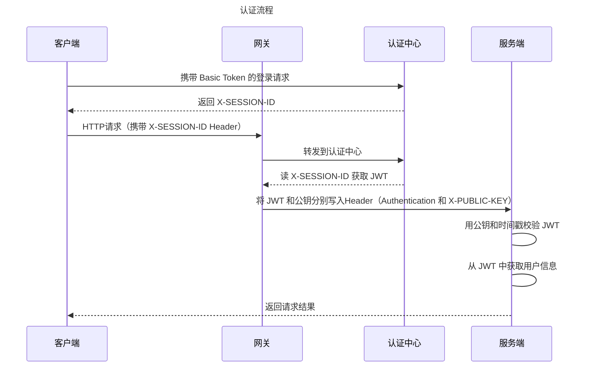
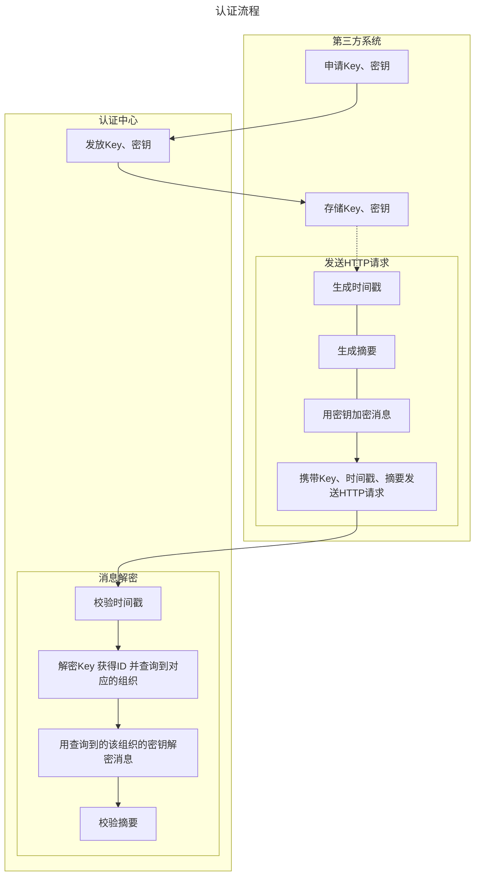

# 认证

## 用户认证（前端）

## 第三方认证

## 签发 JWT

本系统签发的 JWT 采用 ES256 算法。

claim 命名参照 [IANA 机构](https://www.iana.org/assignments/jwt/jwt.xhtml)内已注册的 claim，包含以下内容：

| 字段                 | 含义         | 注释                                        |
|--------------------|------------|-------------------------------------------|
| iss                | 机构名称       | 通过 `geom.jwt.issuer` 配置                   |
| sub                | 认证者ID      | 用户/用户组ID                                  |
| iat                | 令牌签发时间戳    |                                           |
| exp                | 令牌过期时间戳    | 如果当前时间戳大于exp，则令牌视为无效。选填。                  |
| nbf                | 令牌生效时间     | 如果当前时间戳小于nbf，则令牌视为无效。选填。                  |
| jti                | 令牌ID       | 生成的UUID。选填。                               |
| preferred_username | 用户名/用户组编码  |                                           |
| nickname           | 用户昵称/用户组名称 |                                           |
| roles              | 持有者角色      | 类型为 String[]。即用户的角色编码集合。用户组该字段为["GROUP"]  |
| groups             | 所在用户组      | 类型为 String[]。即用户所在用户组的编码的集合。用户组该字段为[]     |
| entitlements       | 持有者权限      | 类型为 String[]。即用户所在用户组的编码的集合。或用户组已订阅接口的集合。 |

# 授权

## 菜单权限

## 数据权限
