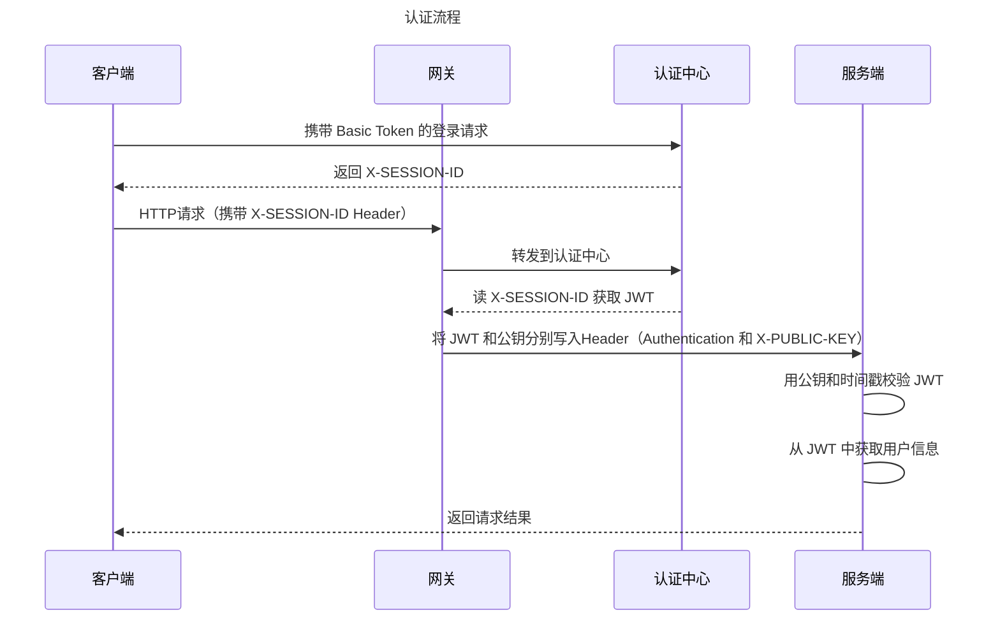

# 认证

## 用户认证（前端）

```mermaid
---
title: 认证流程
---
sequenceDiagram
    participant client AS 客户端
    participant gateway AS 网关
    participant auth AS 认证中心
    participant service AS 服务端
    
    client ->> auth: 携带 Basic Token 的登录请求
    auth -->> client: 返回 X-SESSION-ID
    
    client->> gateway: HTTP请求（携带 X-SESSION-ID Header）
    gateway ->> auth: 转发到认证中心
    auth -->> gateway: 读 X-SESSION-ID 获取 JWT
    gateway ->> service: 将 JWT 和公钥分别写入Header（Authentication 和 X-PUBLIC-KEY）
    
    service -> service: 用公钥和时间戳校验 JWT
    service -> service: 从 JWT 中获取用户信息
    service -->> client: 返回请求结果 
```

# 授权

